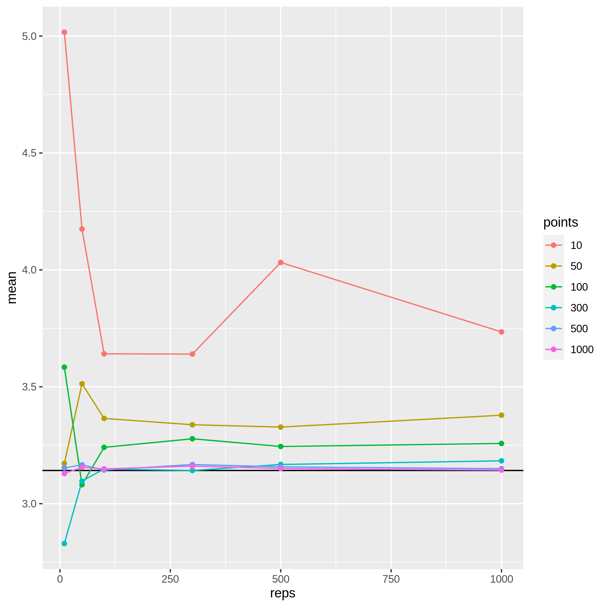

# PI_simulator
Calculate PI using counts of points in a circle inscribed in a square  
The area of a circle is $\pi r^2$.  
The area of a small square made from the radius of said circle is $r^2$.  
If we know the area of both shapes we can calculate $\pi = \frac{\pi r^2}{r^2}$.  
We can estimate that area by drawing many random dots in the square around the circle and than
counting only the points inside the circle and the points in the small square.  
This simulation can be done by hand[^1] many times or in a computer simulation.  

What is the relation between the number of points simulated and the number of simulations we need to run? I wrote a code to test it.  

I attached the plots created by the current code (one can change the number of points and simulations ran)

[^1]: Notice that by hand the points are not truly random & they also are larger in the proportion to the shapes
 so one needs less points in a physical simulation to approximate the area of the shapes

